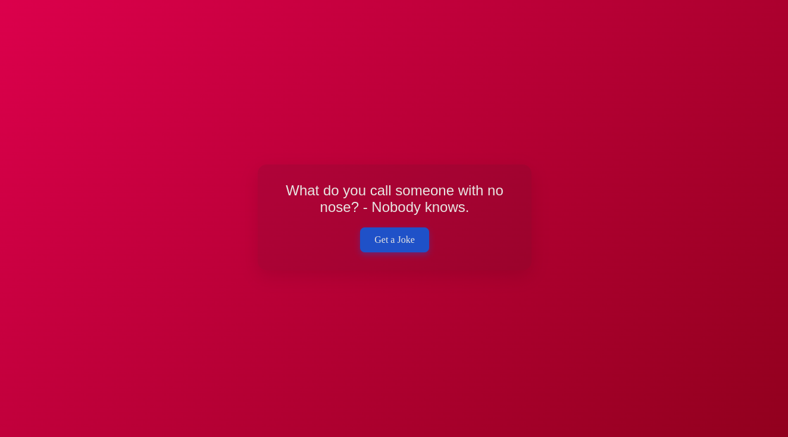

# Jokes Website

Welcome to the **Jokes Website**! This project is a simple, fun web application that fetches random jokes from a public API and displays them to the user when they click the "Get Jokes" button. Built with HTML, CSS, and JavaScript, the site features a modern and responsive design to ensure a smooth and enjoyable user experience.

## Features

- 🌐 **API Integration**: Fetches jokes from a public API.
- 🎉 **Interactive UI**: Click the "Get Jokes" button to load a new joke.
- 💅 **Modern Design**: Clean, minimalistic, and responsive interface.
- 📱 **Responsive Layout**: Optimized for both desktop and mobile devices.

## Screenshots



## Getting Started

Follow these instructions to get a copy of the project up and running on your local machine.

### Prerequisites

Make sure you have the following installed on your machine:

- A web browser

### Installation

1. **Clone the repository**:

    ```bash
    git clone https://github.com/MysteriousImmature/JokeGenerator.git
    cd JokeGenerator
    ```

2. **Open the project**:

    Open the `index.html` file in your browser to view the website.

3. **Run the website**:

    Simply open `index.html` in any web browser.

## Usage

Once the website is running, you can:

- **Get a Joke**: Click the "Get Jokes" button to fetch and display a random joke.
- **New Joke**: Click again for another joke.

## API Reference

This project uses the following public API to fetch jokes:

- **Joke API**: [https://official-joke-api.appspot.com/random_joke](https://official-joke-api.appspot.com/random_joke)

## Acknowledgments

- Thanks to the developers of the [Joke API](https://official-joke-api.appspot.com/random_joke) for providing the joke data.
- Inspired by modern web design practices.

---

Made with ❤️ using HTML, CSS, and JavaScript by [MysteriousImmature](https://github.com/MysteriousImmature/)
